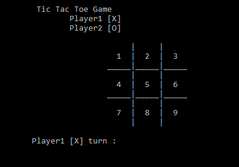

# TicTacToe Game

Tic-tac-toe, or Xs and Os is a game for two players, X and O, who take turns marking the spaces in a 3×3 grid. The player who succeeds in placing three of their marks in a horizontal, vertical, or diagonal row wins the game.




## Functions

```c++
void display_board();-->this function display a board
void player_turn();-->this function to change players roles  and check is a specific box empty or filled
bool gameover();-->this function check the winner and draw case
```